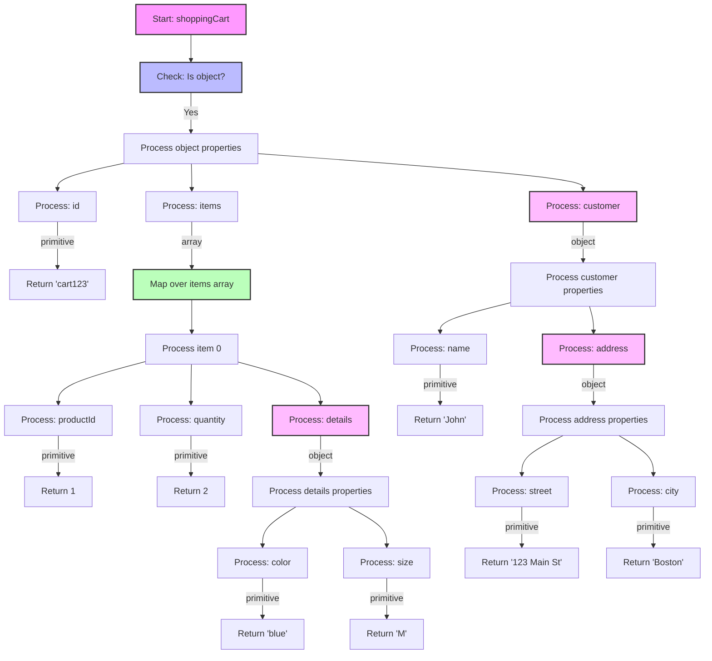

```mermaid
graph TD
    A[Start: shoppingCart] --> B[Check: Is object?]
    B -->|"Yes"| C[Process object properties]
    
    C --> D[Process: id]
    C --> E[Process: items]
    C --> F[Process: customer]
    
    D -->|"primitive"| D1[Return 'cart123']
    
    E -->|"array"| E1[Map over items array]
    E1 --> E2[Process item 0]
    
    E2 --> E3[Process: productId]
    E2 --> E4[Process: quantity]
    E2 --> E5[Process: details]
    
    E3 -->|"primitive"| E3a[Return 1]
    E4 -->|"primitive"| E4a[Return 2]
    
    E5 -->|"object"| E6[Process details properties]
    E6 --> E7[Process: color]
    E6 --> E8[Process: size]
    E7 -->|"primitive"| E7a[Return 'blue']
    E8 -->|"primitive"| E8a[Return 'M']
    
    F -->|"object"| G[Process customer properties]
    G --> H[Process: name]
    G --> I[Process: address]
    
    H -->|"primitive"| H1[Return 'John']
    
    I -->|"object"| J[Process address properties]
    J --> K[Process: street]
    J --> L[Process: city]
    
    K -->|"primitive"| K1[Return '123 Main St']
    L -->|"primitive"| L1[Return 'Boston']

    style A fill:#f9f,stroke:#333,stroke-width:2px
    style B fill:#bbf,stroke:#333,stroke-width:2px
    style E1 fill:#bfb,stroke:#333,stroke-width:2px
    style E5 fill:#fbf,stroke:#333,stroke-width:2px
    style F fill:#fbf,stroke:#333,stroke-width:2px
    style I fill:#fbf,stroke:#333,stroke-width:2px
```