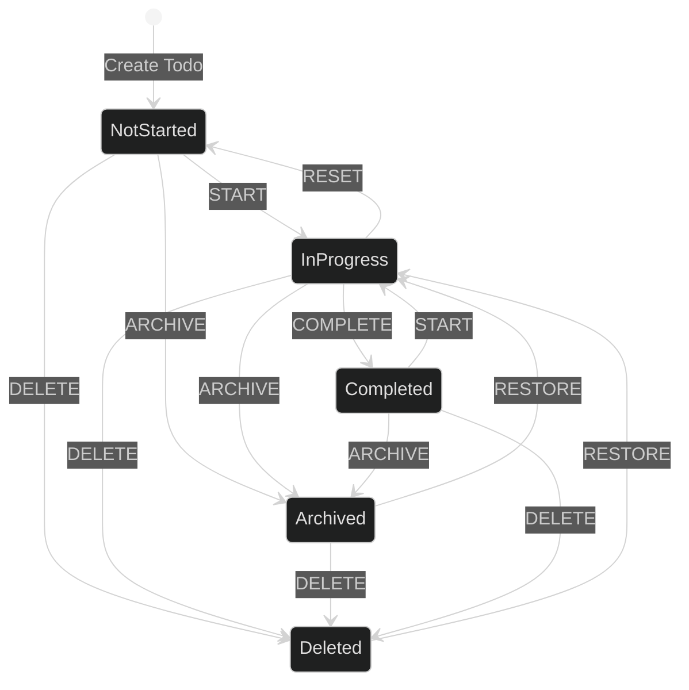

# Outline of State Transitions for Todos

## State Diagram

## State Transition Matrix

| From\To    | NotStarted | InProgress | Completed | Deleted | Archived |
| ---------- | ---------- | ---------- | --------- | ------- | -------- |
| NotStarted | -          | START      | -         | DELETE  | ARCHIVE  |
| InProgress | RESET      | -          | COMPLETE  | DELETE  | ARCHIVE  |
| Completed  | -          | START      | -         | DELETE  | ARCHIVE  |
| Deleted    | -          | RESTORE    | -         | -       | -        |
| Archived   | -          | RESTORE    | -         | DELETE  | -        |

