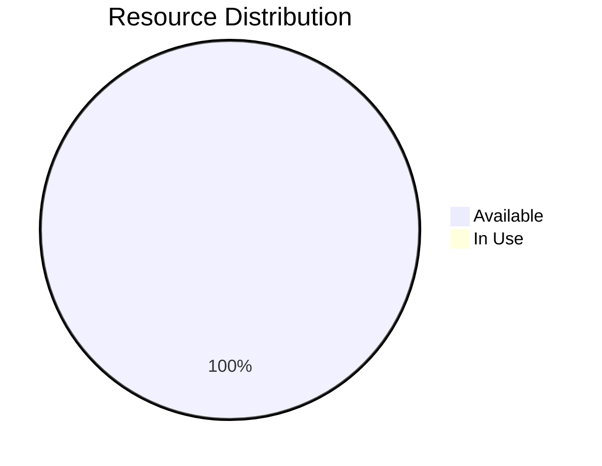
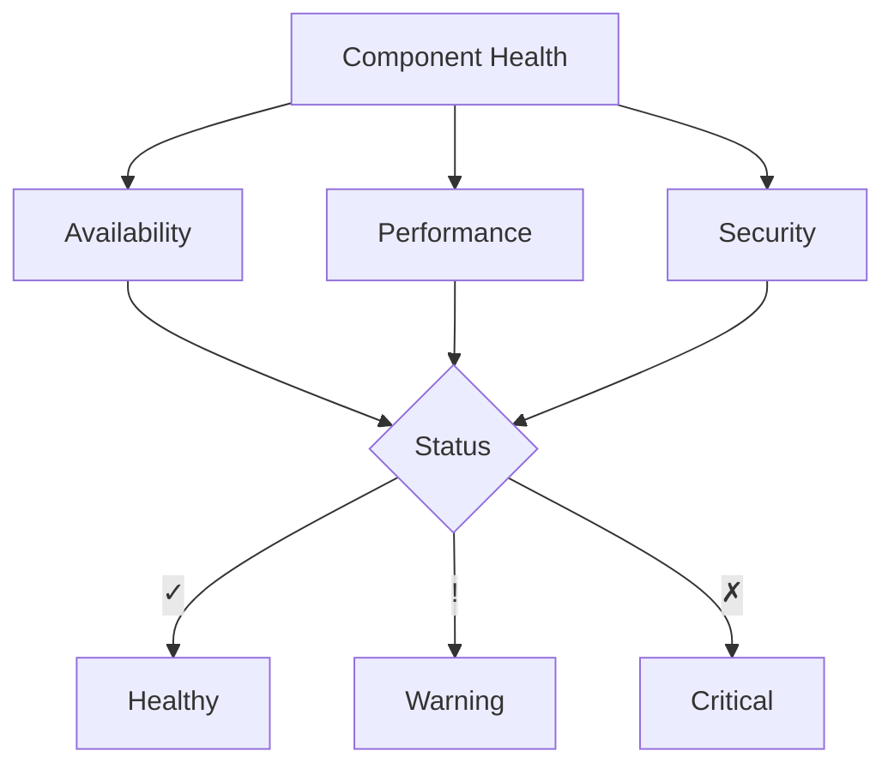

# Workbench: {{BENCH_NAME}}

## System Initialization

- Status: 🟡 Setup Required
- Version: 0.1.0
- Created: <% tp.file.creation_date("YYYY-MM-DD_HH-mm") %>
- Last Modified: <% tp.date.now("YYYY-MM-DD_HH-mm") %>
- Context Layer: {{PRIMARY_CONTEXT}}

## Change Log Templates

When updating this workbench, use these log entry formats:

- Major Updates (X.0.0): 'YYYY-MM-DD_HH-mm - [Breaking Change] Updated [component] to [purpose]'
- Minor Updates (0.X.0): 'YYYY-MM-DD_HH-mm - [Feature] Added [feature] to [component]'
- Patch Updates (0.0.X): 'YYYY-MM-DD_HH-mm - [Fix] Modified [item] in [component]'

## Intelligence Parameters

### Core Parameters

- Type: {{FUNCTION}}
- Function: {{FUNCTION}}
- Access Level: {{LEVEL}}

### Integration Points

- Linked Systems: {{SYSTEMS}}
- Input Streams:
  - Source materials
  - Reference connections
  - Context markers
- Output Channels:
  - Delivery format
  - Quality controls
  - Integration points

## Metrics Dashboard

### Performance Metrics

| Metric        | Current | Target | Status |
|---------------|---------|--------|--------|
| Uptime        | 0%      | 99.9%  | 🔴     |
| Response Time | 0ms     | <100ms | 🔴     |
| Error Rate    | 0%      | <0.1%  | 🟢     |
| Usage         | 0%      | <80%   | 🟢     |

### Resource Utilization

### Health Status

## Workspace Configuration

### Standard Operations

- Initialization Sequence
- Maintenance Procedures
- Error Handling
- Recovery Protocols

### Processing Protocols

- Analysis methods
- Synthesis requirements
- Output specifications

## Version Control

### Version History

- <% tp.date.now("YYYY-MM-DD_HH-mm") %> - Initial bench installation
  - Core systems initialized
  - Basic workflows established
  - Integration pathways configured

## Active Context Map

- Primary focus
- Related concepts
- Critical connections

## Key Performance Indicators

- Throughput metrics
- Quality assessments
- Integration success rates

## Notes and Observations

[Active notes appear here]

## Linked Resources

- [[PARENT_COMPONENT]] - Parent System
- [[RELATED_COMPONENT_1]] - Related System 1
- [[RELATED_COMPONENT_2]] - Related System 2

## Status Indicators Reference

- 🟢 Active/Healthy/Complete
- 🟡 In Progress/Warning
- 🔴 Inactive/Critical/Blocked
- ✅ Verified
- ❌ Failed
- ⚠️ Warning
- ℹ️ Information
