# WORKBENCH: {{BENCH_NAME}}

## 🔄 SYSTEM INITIALIZATION
- Status: 🟡 Setup Required
- Version: 0.1.0
- Created: <% tp.file.creation_date("YYYY-MM-DD_HH-mm") %>
- Last Modified: <% tp.date.now("YYYY-MM-DD_HH-mm") %>
- Context Layer: {{PRIMARY_CONTEXT}}

## 📝 CHANGE LOG TEMPLATES
When updating this workbench, use these log entry formats:
- Major Updates (X.0.0): 'YYYY-MM-DD_HH-mm - [Breaking Change] Updated [component] to [purpose]'
- Minor Updates (0.X.0): 'YYYY-MM-DD_HH-mm - [Feature] Added [feature] to [component]'
- Patch Updates (0.0.X): 'YYYY-MM-DD_HH-mm - [Fix] Modified [item] in [component]'

## ⚙️ INTELLIGENCE PARAMETERS
### Core Parameters
- Type: {{FUNCTION}}
- Function: {{FUNCTION}}
- Access Level: {{LEVEL}}

### Integration Points
- Linked Systems: {{SYSTEMS}}
- Input Streams: 
  - Source materials
  - Reference connections
  - Context markers
- Output Channels: 
  - Delivery format
  - Quality controls
  - Integration points

## 📊 METRICS DASHBOARD
### Performance Metrics
| Metric | Current | Target | Status |
|--------|---------|--------|--------|
| Uptime | 0% | 99.9% | 🔴 |
| Response Time | 0ms | <100ms | 🔴 |
| Error Rate | 0% | <0.1% | 🟢 |
| Usage | 0% | <80% | 🟢 |

### Resource Utilization

### Health Status

```mermaid
graph TD
    A[Component Health] --> B[Availability]
    A --> C[Performance]
    A --> D[Security]
    B --> E{Status}
    C --> E
    D --> E
    E -->|✓| F[Healthy]
    E -->|!| G[Warning]
    E -->|✗| H[Critical]
```

## 🔧 WORKSPACE CONFIGURATION
### Standard Operations
- Initialization Sequence
- Maintenance Procedures
- Error Handling
- Recovery Protocols

### Processing Protocols
- Analysis methods
- Synthesis requirements
- Output specifications

## 📈 VERSION CONTROL
### Version History
- <% tp.date.now("YYYY-MM-DD_HH-mm") %> - Initial bench installation
  - Core systems initialized
  - Basic workflows established
  - Integration pathways configured

## 🔗 ACTIVE CONTEXT MAP
- Primary focus
- Related concepts
- Critical connections

## 📌 NOTES AND OBSERVATIONS
[Active notes appear here]

## 🔗 LINKED RESOURCES
- [[PARENT_COMPONENT]] - Parent System
- [[RELATED_COMPONENT_1]] - Related System 1
- [[RELATED_COMPONENT_2]] - Related System 2

## 📌 STATUS INDICATORS REFERENCE
- 🟢 Active/Healthy/Complete
- 🟡 In Progress/Warning
- 🔴 Inactive/Critical/Blocked
- ✅ Verified
- ❌ Failed
- ⚠️ Warning
- ℹ️ Information