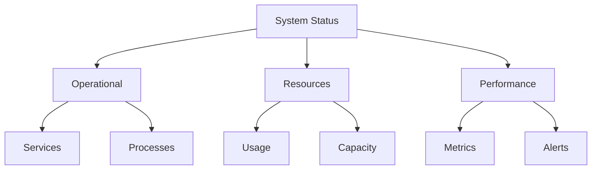
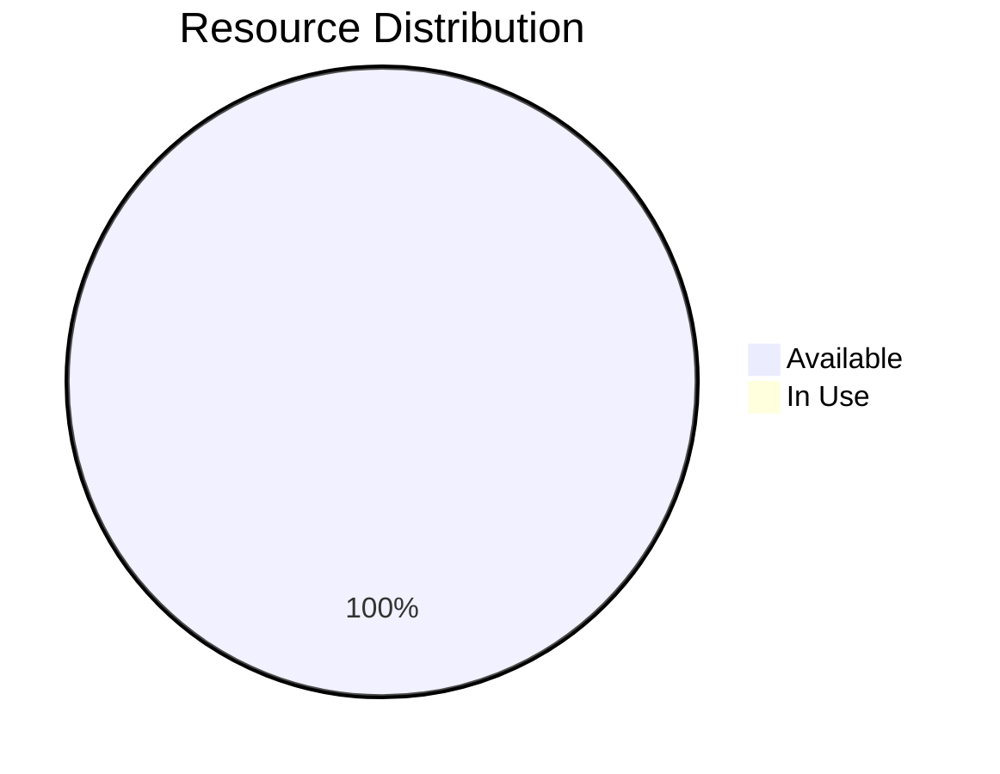
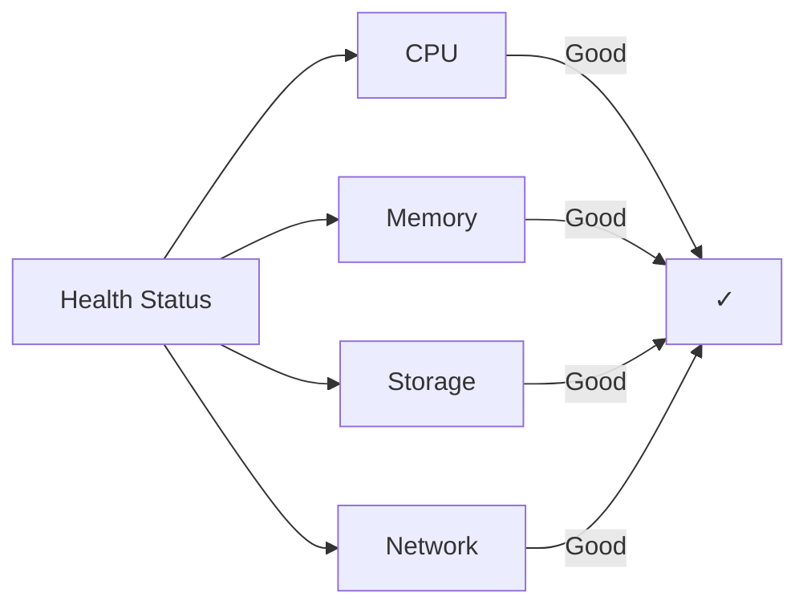

# SYSTEM STATUS BOARD

## SYSTEM INITIALIZATION

- Status: Active
- Created: <% tp.file.creation_date("YYYY-MM-DD_HH-mm") %>
- Last Modified: <% tp.date.now("YYYY-MM-DD_HH-mm") %>
- Context Layer: System Monitoring

## CHANGE LOG TEMPLATES

When updating this workspace, use these log entry formats:

- Status Updates: 'YYYY-MM-DD_HH-mm - Updated [component] status to [state]'
- Metric Changes: 'YYYY-MM-DD_HH-mm - Modified [metric] tracking for [purpose]'
- Alert Updates: 'YYYY-MM-DD_HH-mm - Added/Modified alert for [condition]'

## SYSTEM OVERVIEW

### Current Status

## COMPONENT STATUS

### Workbench Status

| Workbench | Status | Load | Health |
| --------- | ------ | ---- | ------ |
| Analysis  | Online | 0%   | Good   |
| Synthesis | Online | 0%   | Good   |
| Creation  | Online | 0%   | Good   |
| Review    | Online | 0%   | Good   |

### Resource Status

| Resource   | Usage | Available | Status |
| ---------- | ----- | --------- | ------ |
| Processing | 0%    | 100%      | Good   |
| Storage    | 0%    | 100%      | Good   |
| Network    | 0%    | 100%      | Good   |
| Memory     | 0%    | 100%      | Good   |

## PERFORMANCE METRICS

### System Performance

- Response Time: 0ms
- Throughput: 0 ops/sec
- Error Rate: 0%
- Uptime: 100%

### Resource Utilization

## MONITORING DASHBOARD

### Active Alerts

- No current alerts

### Recent Events

| Timestamp | Event | Severity | Status |
| --------- | ----- | -------- | ------ |
| -         | -     | -        | -      |

### System Health

## VERSION CONTROL

### Modification History

- 2024-12-07_08-00 - Initial status board setup

  - Core monitoring implemented
  - Basic metrics established
  - Component tracking created

- 2024-12-07_09-00 - Enhanced monitoring

  - Added visualization tools
  - Implemented health checks
  - Created alert system

- 2024-12-07_10-00 - Integration update

  - Connected all components
  - Linked to maintenance
  - Enhanced status tracking

## MAINTENANCE STATUS

### Scheduled Maintenance

- No scheduled maintenance

### Update Status

- System Version: 1.0.0
- Last Update: Initial Setup
- Next Update: TBD

## LINKED RESOURCES

- [[01_DESK]] - Command Center
- [[01_ACTIVE_PROJECTS]] - Project Status
- [[02_CURRENT_BUILDS]] - Build Status
- [[02_PROTOCOLS]] - System Protocols