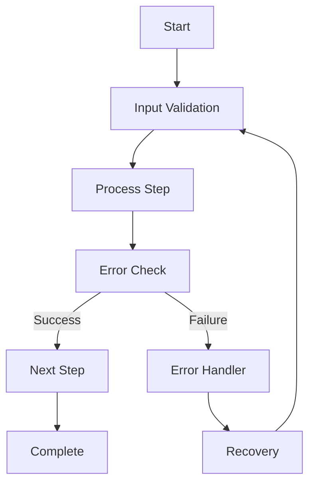
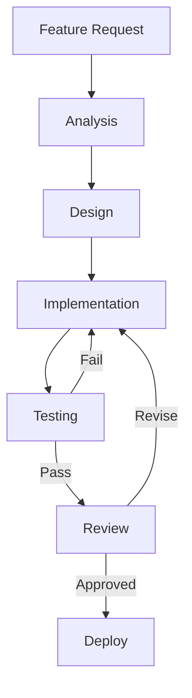

# AUTOMATION WORKFLOWS

## SYSTEM INITIALIZATION
- Status: Active
- Created: <% tp.file.creation_date("YYYY-MM-DD_HH-mm") %>
- Last Modified: <% tp.date.now("YYYY-MM-DD_HH-mm") %>
- Context Layer: Automation Workflows

## CHANGE LOG TEMPLATES
When updating this workspace, use these log entry formats:
- Workflow Updates: 'YYYY-MM-DD_HH-mm - Updated [workflow] for [purpose]'
- Step Changes: 'YYYY-MM-DD_HH-mm - Modified [step] in [workflow] to enhance [capability]'
- Integration Updates: 'YYYY-MM-DD_HH-mm - Connected [workflow] with [system]'

## WORKFLOW DEFINITIONS

### Standard Workflow Template

### Development Workflow

## WORKFLOW CATEGORIES

### 1. System Operations
#### Initialization Workflows
- System startup sequence
- Component initialization
- Service activation
- Health verification

#### Maintenance Workflows
- Backup procedures
- Update processes
- Cleanup routines
- Performance optimization

### 2. Development Operations
#### Feature Development
- Requirements analysis
- Design process
- Implementation steps
- Testing procedures
- Deployment sequence

#### Bug Resolution
- Issue identification
- Root cause analysis
- Fix implementation
- Verification process
- Documentation update

### 3. Integration Operations
#### System Integration
- Connection establishment
- Data flow setup
- Validation procedures
- Monitoring configuration

#### Deployment
- Environment preparation
- Component deployment
- Integration testing
- Release procedures

## WORKFLOW CONTROLS

### Error Handling
- Error detection
- Recovery procedures
- Fallback mechanisms
- Notification systems

### State Management
- Progress tracking
- State persistence
- Recovery points
- Completion verification

## MONITORING AND METRICS

### Performance Tracking
- Execution time
- Success rate
- Resource usage
- Bottleneck detection

### Quality Metrics
- Error frequency
- Recovery success
- SLA compliance
- User satisfaction

## VERSION CONTROL
### Modification History
- 2024-12-07_08-00 - Initial workflow setup
  - Core workflows defined
  - Basic templates created
  - Error handling implemented
- 2024-12-07_09-00 - Enhanced workflow management
  - Added categorization
  - Implemented monitoring
  - Created control systems
- 2024-12-07_10-00 - Integration update
  - Connected with scripts
  - Added metrics tracking
  - Enhanced error handling

## LINKED RESOURCES
- [[01_SCRIPTS]] - Automation Scripts
- [[03_INTEGRATIONS]] - System Integrations
- [[03_STATUS_BOARD]] - System Status
- [[02_PROTOCOLS]] - System Protocols