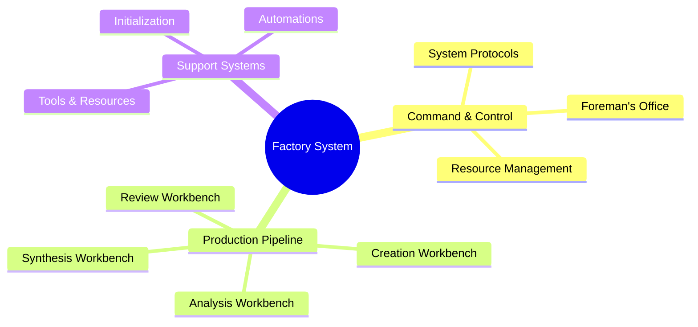
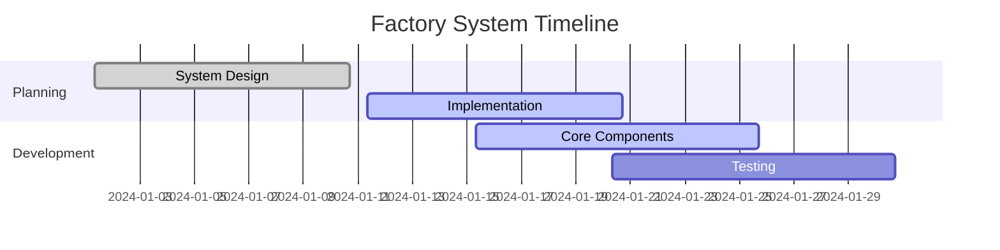
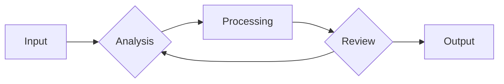

# WHITEBOARD: PLANNING AND VISUALIZATION CENTER

## SYSTEM INITIALIZATION

- Status: Active
- Created: 2024-12-09_12-05
- Last Modified: 2024-12-13_12-24
- Context Layer: Planning & Visualization

## CHANGE LOG TEMPLATES

When updating this workspace, use these log entry formats:

- Planning Updates: 'YYYY-MM-DD_HH-mm - Updated [plan/diagram] for [purpose]'
- Visualization Changes: 'YYYY-MM-DD_HH-mm - Modified [visual] to show [information]'
- Integration Updates: 'YYYY-MM-DD_HH-mm - Connected [system] with [component]'

## CHANGE LOG

Use format: 'YYYY-MM-DD_HH-mm - [Type]: [Description]'

## CURRENT PLANNING BOARD

### Strategic Overview

### Active Planning Areas

1. Project Planning

   - Timeline visualization
   - Resource allocation
   - Milestone tracking
   - Dependencies mapping

2. Process Optimization

   - Workflow diagrams
   - Bottleneck analysis
   - Efficiency metrics
   - Improvement proposals

3. Resource Planning

   - Capacity planning
   - Tool allocation
   - Workbench utilization
   - System resources

### Quick Notes Section

- Temporary notes and ideas
- Meeting outcomes
- Quick sketches
- Action items

## VISUALIZATION TOOLS

### Project Timeline Template

### Process Flow Template

## VERSION CONTROL

### Modification History

- 2024-12-07_08-00 - Initial whiteboard setup

  - Core visualization tools implemented
  - Planning frameworks established
  - Basic diagrams created

- 2024-12-07_09-00 - Enhanced visualization system

  - Added Mermaid diagrams
  - Implemented planning templates
  - Created resource tracking

- 2024-12-07_10-00 - Integration update

  - Connected to all workbenches
  - Linked with status board
  - Enhanced cross-system references

## LINKED RESOURCES

- [[01_DESK]] - Command Center
- [[03_TOOLBOX]] - Available Tools
- [[01_ACTIVE_PROJECTS]] - Current Projects
- [[03_STATUS_BOARD]] - System Status