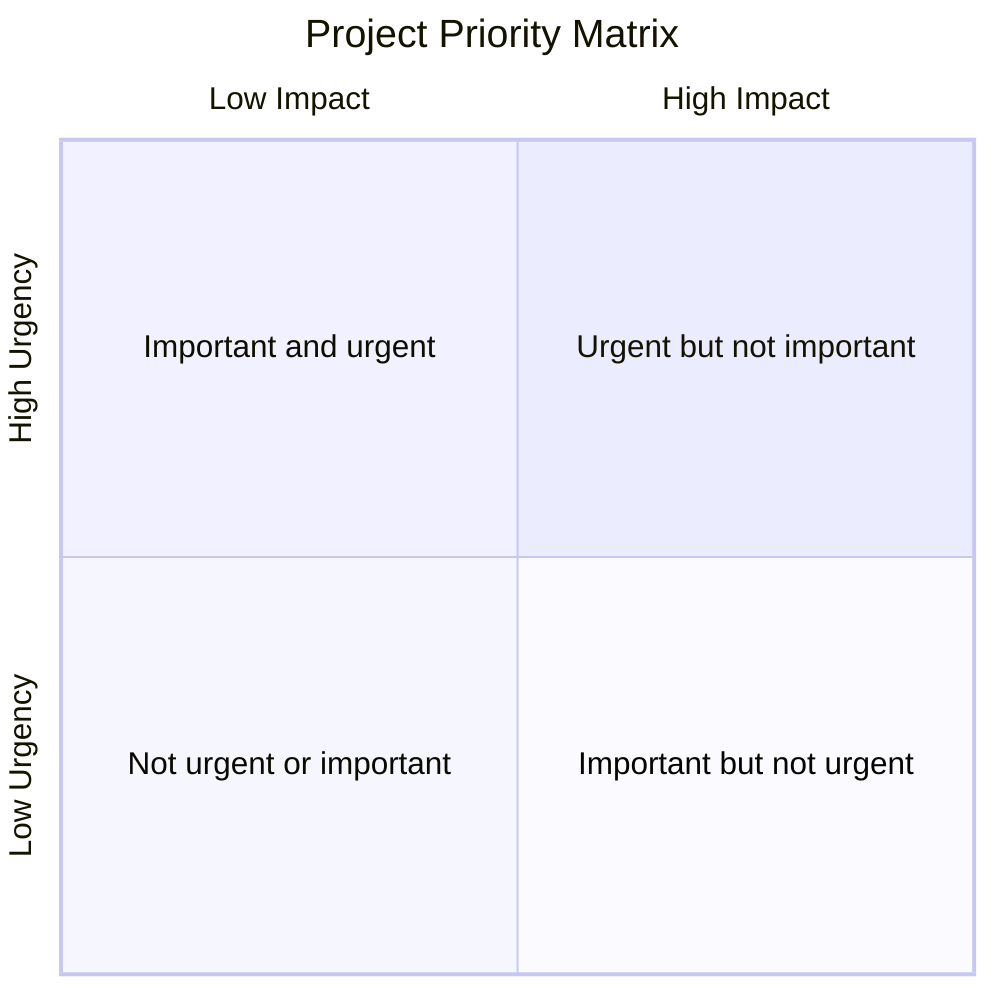
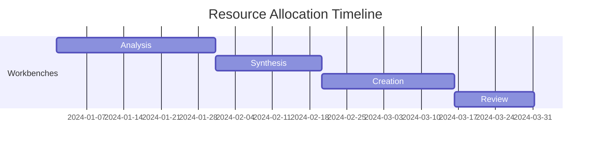

# ACTIVE PROJECTS

## SYSTEM INITIALIZATION

- Status: Active
- Created: 2024-12-09_12-05
- Last Modified: 2024-12-13_12-24
- Context Layer: Project Management

## CHANGE LOG TEMPLATES

When updating this workspace, use these log entry formats:

- Project Updates: 'YYYY-MM-DD_HH-mm - Updated [project] status to [state]'
- Resource Changes: 'YYYY-MM-DD_HH-mm - Modified [resource] allocation for [project]'
- Metric Updates: 'YYYY-MM-DD_HH-mm - Updated [metric] tracking for [purpose]'

## PROJECT ROSTER

### Template Project Entry

```markdown
#### [Project Name]
- Status: [Planning/Active/Review/Complete]
- Start Date: YYYY-MM-DD_HH-mm
- Target Date: YYYY-MM-DD_HH-mm
- Priority: [High/Medium/Low]
- Workbench Assignment: [[Workbench Name]]

##### Objectives
- [Primary objective]
- [Secondary objectives]

##### Current Phase
- [Description of current work phase]
- [Key activities]
- [Expected outcomes]

##### Resources
- [Allocated resources]
- [Required tools]
- [Dependencies]

##### Metrics
- [Progress indicators]
- [Quality measures]
- [Performance metrics]

##### Notes
- [Important observations]
- [Decisions made]
- [Action items]
```

## ACTIVE PROJECTS LIST

[Projects will be added here as they are initiated]

## PROJECT METRICS DASHBOARD

### Overall Status

- Total Active Projects: 0
- Projects in Planning: 0
- Projects in Execution: 0
- Projects in Review: 0

### Resource Allocation

- Analysis Workbench: 0%
- Synthesis Workbench: 0%
- Creation Workbench: 0%
- Review Workbench: 0%

### Timeline Status

- Projects On Schedule: 0
- Projects At Risk: 0
- Projects Delayed: 0

## PROJECT MANAGEMENT TOOLS

### Priority Matrix



### Resource Timeline



## VERSION CONTROL

### Modification History

- 2024-12-07_08-00 - Initial projects setup

  - Core project structure created
  - Basic tracking implemented
  - Templates established

- 2024-12-07_09-00 - Enhanced project management

  - Added metrics dashboard
  - Implemented resource tracking
  - Created visualization tools

- 2024-12-07_10-00 - Integration update

  - Connected with workbenches
  - Linked to status board
  - Enhanced project monitoring


## LINKED RESOURCES

- [[01_DESK]] - Command Center
- [[02_CURRENT_BUILDS]] - Build Status
- [[03_STATUS_BOARD]] - System Status
- [[02_WHITEBOARD]] - Planning Center