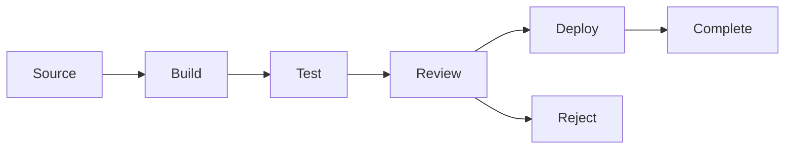
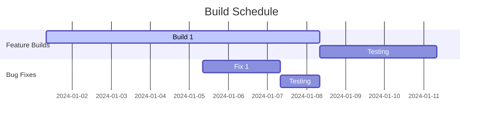

# CURRENT BUILDS

## SYSTEM INITIALIZATION

- Status: Active
- Created: 2024-12-09_12-05
- Last Modified: 2024-12-13_12-24
- Context Layer: Build Management

## CHANGE LOG TEMPLATES

When updating this workspace, use these log entry formats:

- Build Updates: 'YYYY-MM-DD_HH-mm - Updated [build] status to [state]'
- Test Changes: 'YYYY-MM-DD_HH-mm - Modified [test suite] for [purpose]'
- Process Updates: 'YYYY-MM-DD_HH-mm - Enhanced [process] for [improvement]'

## BUILD TRACKING

### Template Build Entry

```markdown
#### [Build Name] - v[X.Y.Z]
- Status: [In Progress/Testing/Complete]
- Build Start: YYYY-MM-DD_HH-mm
- Last Updated: YYYY-MM-DD_HH-mm
- Build Type: [Feature/Fix/Improvement]

##### Components
- [Component 1]
- [Component 2]
- [Dependencies]

##### Build Steps
1. [Step 1]
2. [Step 2]
3. [Testing]
4. [Deployment]

##### Verification
- [ ] Unit Tests
- [ ] Integration Tests
- [ ] Performance Tests
- [ ] Security Checks

##### Notes
- [Build observations]
- [Issues encountered]
- [Solutions implemented]
```

## ACTIVE BUILDS

[Current builds will be listed here]

## BUILD METRICS

### Build Status Overview

- Total Active Builds: 0
- Builds in Progress: 0
- Builds in Testing: 0
- Completed Builds: 0

### Build Performance

- Average Build Time: 0min
- Test Coverage: 0%
- Success Rate: 0%
- Failed Builds: 0

## BUILD VISUALIZATION

### Build Pipeline



### Build Timeline



## VERSION CONTROL

### Modification History

- 2024-12-07_08-00 - Initial builds setup

  - Core build tracking created
  - Basic metrics implemented
  - Templates established

- 2024-12-07_09-00 - Enhanced build system

  - Added visualization tools
  - Implemented quality gates
  - Created performance tracking

- 2024-12-07_10-00 - Integration update

  - Connected with projects
  - Linked to status board
  - Enhanced build monitoring


## BUILD TOOLS

### Automated Processes

- Build Scripts
- Test Automation
- Deployment Tools
- Monitoring Systems

### Quality Gates

- Code Review
- Test Coverage
- Performance Metrics
- Security Scans

## LINKED RESOURCES

- [[01_ACTIVE_PROJECTS]] - Project List
- [[03_STATUS_BOARD]] - System Status
- [[03_CREATION_BENCH]] - Build Creation
- [[04_REVIEW_BENCH]] - Quality Control