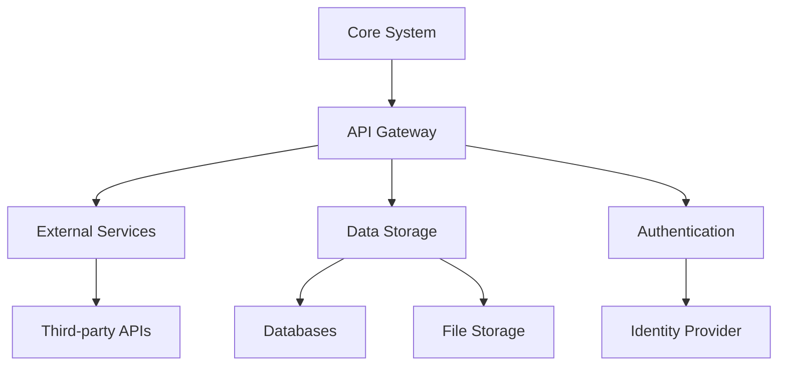

# SYSTEM INTEGRATIONS

## SYSTEM INITIALIZATION

- Status: Active
- Created: 2024-12-09_12-05
- Last Modified: 2024-12-13_12-24
- Context Layer: System Integrations

## CHANGE LOG TEMPLATES

When updating this workspace, use these log entry formats:

- Integration Updates: 'YYYY-MM-DD_HH-mm - Updated [integration] for [purpose]'
- Connection Changes: 'YYYY-MM-DD_HH-mm - Modified [connection] to enhance [capability]'
- System Updates: 'YYYY-MM-DD_HH-mm - Connected [system] with [integration]'

## INTEGRATION ARCHITECTURE

### System Overview



### Connection Templates

```javascript
{
    "integration": {
        "name": "[Integration Name]",
        "type": "[Service Type]",
        "version": "[API Version]",
        "endpoint": "[URL/URI]",
        "auth": {
            "type": "[Auth Method]",
            "credentials": "[Reference]"
        },
        "config": {
            "timeout": "[Duration]",
            "retry": "[Policy]",
            "rateLimit": "[Limits]"
        }
    }
}
```

## INTEGRATION CATEGORIES

### 1. External Services

#### API Integrations

- REST endpoints
- GraphQL services
- WebSocket connections
- Message queues

#### Authentication Services

- OAuth providers
- SSO systems
- Token services
- Identity management

### 2. Data Systems

#### Storage Solutions

- Database connections
- File storage systems
- Cache services
- Backup systems

#### Data Processing

- ETL pipelines
- Stream processing
- Batch operations
- Analytics services

### 3. Development Tools

#### CI/CD Systems

- Build services
- Deployment platforms
- Testing frameworks
- Monitoring tools

#### Code Management

- Version control
- Code review
- Documentation
- Package management

## INTEGRATION PROTOCOLS

### Authentication

- OAuth 2.0
- API keys
- JWT tokens
- Client certificates

### Data Exchange

- REST
- GraphQL
- gRPC
- WebSocket

## MONITORING AND SECURITY

### Performance Monitoring

- Response times
- Error rates
- Throughput
- Resource usage

### Security Measures

- Encryption
- Rate limiting
- Access control
- Audit logging

## VERSION CONTROL

### Modification History

- 2024-12-07_08-00 - Initial integration setup

  - Core connections defined
  - Basic auth implemented
  - Monitoring established

- 2024-12-07_09-00 - Enhanced integration management

  - Added security measures
  - Implemented logging
  - Created monitoring systems

- 2024-12-07_10-00 - Protocol update

  - Added new protocols
  - Enhanced security
  - Improved monitoring


## LINKED RESOURCES

- [[01_SCRIPTS]] - Automation Scripts
- [[02_WORKFLOWS]] - Automation Workflows
- [[03_STATUS_BOARD]] - System Status
- [[02_PROTOCOLS]] - System Protocols